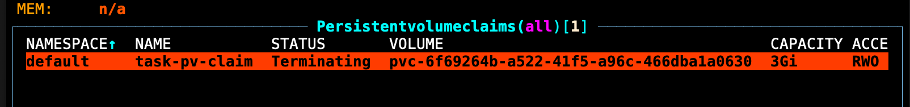

# cnskunkworks-unterminate

_Oh no!_

This repository will show you how to unterminate terminating kubernetes resources.
It relies on manipulating the data structures within ETCD directly

## What you will need

- A kubernetes cluster
- ETCD certificates 
- A port forward to ETCD within the cluster

### Our example

- Based on a `kind` cluster with Rancher's [local path provisioner](https://github.com/rancher/local-path-provisioner) installed.
- ETCD Certs
  - E.g. copy locally `docker cp deb7df53bda4:/etc/kubernetes/pki/etcd etcd`
  - Check it works e.g ` ETCDCTL_API=3 etcdctl --cacert=etcd/ca.crt --key=etcd/server.key --cert=etcd/`